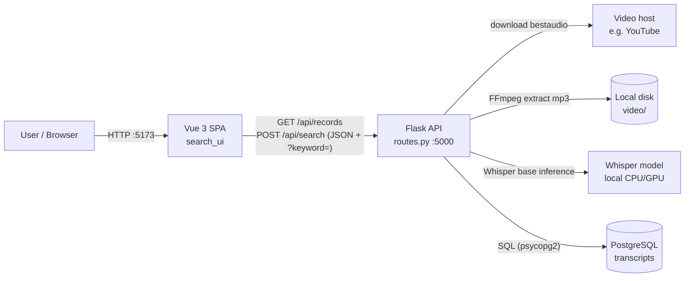
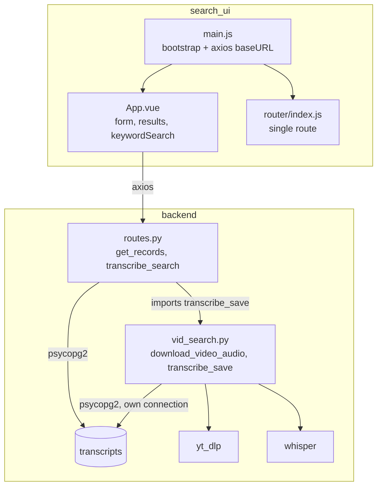
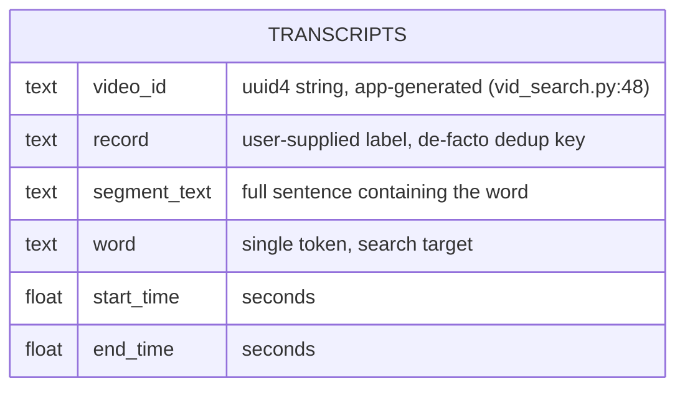
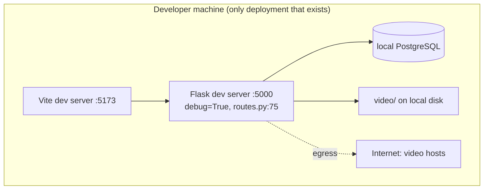
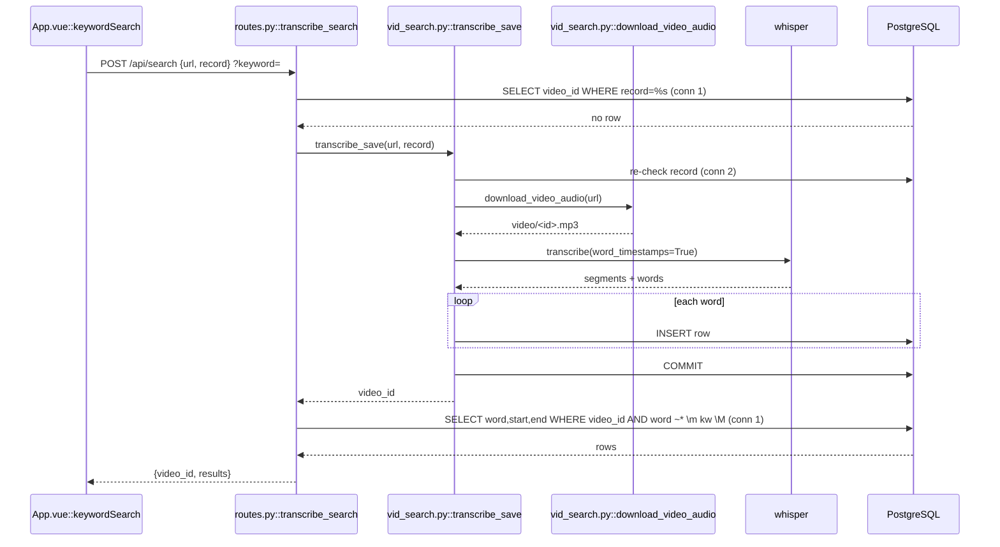
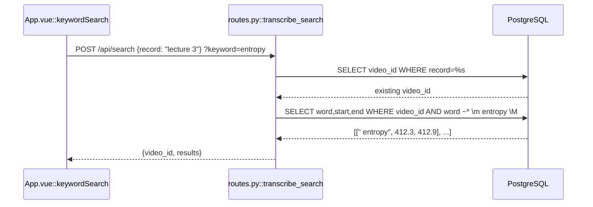

# vid_search — Project Synthesis

**Stack:** Python 3 / Flask / OpenAI Whisper / yt-dlp / PostgreSQL / Vue 3 + Vite | **Status:** prototype (local dev only) | **Repo:** ~/Repos/vid_search

## 1. What it is (30 seconds)

vid_search is a full-stack video keyword search tool: you give it a video URL and a keyword, and it tells you the exact timestamps where that word is spoken. A Flask API downloads the audio with yt-dlp, transcribes it locally with OpenAI Whisper using word-level timestamps, and stores every word as a row in PostgreSQL. Search is then a Postgres case-insensitive regex query with word boundaries, so repeat searches on an already-transcribed video are instant. A Vue 3 SPA fronts it, with a "record" label system that dedupes transcriptions so each video is only processed once. The interesting technical core is the trade-off: pay the transcription cost once, up front, into a word-indexed store, so all subsequent searches are cheap SQL instead of re-running ML inference.

## 2. Scaffolding

```
vid_search/
├── vid_search.py        # Ingestion: yt-dlp download + Whisper transcription + DB writes (65 lines)
├── routes.py            # Flask app, CORS, the two API endpoints, dev entrypoint (74 lines)
├── .gitignore           # excludes .env, video/ (downloaded audio), __pycache__, node_modules, dist
└── search_ui/           # Vue 3 SPA scaffolded with Vite
    ├── package.json     # axios, vue 3.5, vue-router 4.4; eslint + prettier as dev deps
    ├── vite.config.js   # @ alias to src/
    ├── index.html       # SPA mount point
    └── src/
        ├── main.js      # app bootstrap; axios baseURL from VITE_API_URL env
        ├── App.vue      # the entire UI: form, results list, about tab, styles (253 lines)
        ├── router/index.js  # single route '/' → App.vue
        └── assets/      # base.css, main.css, logo.svg
```

The organizing principle is by tier, not by feature: Python backend at repo root, frontend isolated in `search_ui/`. Within the backend the split is by responsibility: `routes.py` owns HTTP concerns (parsing, CORS, response shaping) and `vid_search.py` owns the ingestion pipeline; the only cross-import is `routes.py:5` pulling in `transcribe_save`. The dependency direction is clean: routes → pipeline, never the reverse.

Placement rule for new code: HTTP handling goes in `routes.py`, anything touching yt-dlp/Whisper goes in `vid_search.py`, and anything user-visible goes in `App.vue`. That rule works at this size and stops working almost immediately after: there is no `db.py` (connection logic is copy-pasted three times: `routes.py:20-22`, `routes.py:43-45`, `vid_search.py:35-37`), no models module, and no config module beyond `environ` reads at import time (`routes.py:7-8`, `vid_search.py:8-9`).

Honest drift and gaps: there is no `requirements.txt` or `pyproject.toml`, so the Python environment is not reproducible from the repo (dependencies are inferred from imports: psycopg2, django-environ, openai-whisper, yt-dlp, flask, flask-cors). `numpy` is imported and never used (`vid_search.py:6`). `vue-router` is installed and wired (`src/router/index.js`) but the app has one route and does tab switching with a `currentPage` ref instead (`App.vue:114`), so the router is dead weight. `search_ui/README.md` is untouched Vite boilerplate. There is no DDL file anywhere; the `transcripts` table schema exists only implicitly in the INSERT statement (`vid_search.py:57-63`).

Build/run: backend is `python routes.py` (Flask dev server, debug=True, `routes.py:74-75`); frontend is `npm run dev` (Vite, `package.json` scripts). No test command exists in either tier.

## 3. Data structures and algorithms

**The inverted-index-by-brute-force table.** The core data structure is the `transcripts` table with one row per spoken word: `(video_id, record, segment_text, word, start_time, end_time)` (`vid_search.py:57-63`). This is effectively a denormalized positional index: instead of storing a transcript document and searching it at query time, every word is pre-exploded into a row with its float timestamps. A 1-hour video at ~150 words/minute produces ~9,000 rows. Access pattern that justifies it: the product question is "at what times is word X said," which becomes a single indexed-scan-shaped query rather than substring math over a text blob.

**Word-boundary regex search.** `routes.py:58` builds `\m{keyword}\M`, Postgres-specific word-boundary anchors, and applies it with `~*` (case-insensitive regex match) filtered by `video_id` (`routes.py:60-64`). Complexity is O(rows for that video) per search since there is no index on `(video_id)` or trigram index on `word`; at prototype scale that is a few thousand sequential-scan rows and is fine. The keyword is passed as a bound parameter, so it is injection-safe, but it is interpolated into a regex pattern unescaped, so a keyword like `a(b` throws a Postgres regex error and `(a+)+$`-style patterns are a ReDoS surface (documented as a weakness in §9).

**Idempotency via record lookup.** Both the route (`routes.py:47-55`) and the pipeline (`vid_search.py:39-42`) check `SELECT video_id FROM transcripts WHERE record = %s LIMIT 1` before doing work. The record label is the dedup key: if it exists, reuse the stored `video_id` and skip download+transcription entirely. This is check-then-act without a unique constraint, so two concurrent requests with the same new record label both transcribe and both insert (race documented in §8).

**UUID identity.** `video_id` is an application-generated `uuid.uuid4()` (`vid_search.py:48`) rather than a DB sequence, which keeps the insert loop free of any RETURNING round-trip and would survive a move to sharded storage unchanged.

**The nested iteration.** Whisper returns segments containing words; ingestion is a straightforward two-level loop `for segment in result["segments"]: for word in segment['words']` (`vid_search.py:50-63`) issuing one INSERT per word inside a single transaction, committed once at `vid_search.py:65`. That is N round-trips where one `execute_values` batch would do; correct but O(N) network chatter (remediation in §9).

This project is honestly CRUD-plus-pipeline. The real complexity lives in the ingestion cost model (minutes of ML inference per video, amortized to zero on repeat searches), the idempotency/concurrency surface around the record key, and the regex search semantics, not in any classical algorithm.

## 4. Architecture

**Flask API (`routes.py`).** Owns HTTP. Two endpoints: `GET /api/records` returns `SELECT DISTINCT record` for the dropdown (`routes.py:14-29`); `POST /api/search` is the workhorse that dedupes, optionally triggers transcription synchronously, and runs the keyword query (`routes.py:32-72`). Contract: JSON body `{url, record}` plus `keyword` as a query-string param (a mixed contract, noted in §9); responses are `{video_id, results: [[word, start, end], ...]}` or `{error}` with 400/500. CORS is restricted to origins from the `CORS_ORIGINS` env var, scoped to `/api/*` (`routes.py:10-12`).

**Ingestion pipeline (`vid_search.py`).** `download_video_audio` (`vid_search.py:11-31`) shells into yt-dlp for bestaudio, post-processes to mp3 via FFmpeg, writes to the git-ignored `video/` directory. `transcribe_save` (`vid_search.py:33-65`) opens its own DB connection, re-checks the dedup key, runs Whisper `base` with `word_timestamps=True` (`vid_search.py:45-46`), and bulk-loops the words into Postgres. It is called synchronously from the request thread, so a first-time search request blocks for the full download+transcription duration.

**PostgreSQL.** Single table `transcripts`, doubling as both the dedup registry (record → video_id) and the search index (word rows). No DDL in repo, no visible indexes or constraints.

**Vue 3 SPA (`search_ui/`).** Single component `App.vue` using the composition API: loads records on mount (`App.vue:79-85`), submits searches via `keywordSearch` (`App.vue:88-112`), prefers the dropdown selection over a typed record label (`App.vue:92`), and renders `[word, start, end]` tuples. `main.js` sets the axios base URL from `VITE_API_URL`, keeping the API location out of source.

Tenancy and auth: there is neither. Every caller sees every record and can trigger arbitrary-URL downloads; this is a single-user local tool and §8 treats the open surface as the top accepted risk.

**Decisions and rejections.**

- Local Whisper over a cloud STT API: zero per-request cost and no data leaves the machine; rejected cloud STT because a prototype exercising the pipeline shouldn't carry a billing dependency. Cost is minutes of CPU inference per video (`vid_search.py:45-46`).
- Per-word rows over full-text search (tsvector) or storing the transcript JSON: tsvector gives you *whether* a word appears, not *when*; the product is timestamps, so word rows with times are the actual requirement. Rejected keeping Whisper JSON blobs because every search would re-parse them.
- Postgres regex over `LIKE`: `\m...\M` gives whole-word matching so searching "art" doesn't hit "start" (`routes.py:58`); `LIKE '%art%'` cannot express that.
- Synchronous transcription over a job queue: honest prototype shortcut. Correct evolution is a queue + polling (laid out in §9); at one user, blocking is tolerable and vastly simpler.
- User-supplied record label as the dedup key over the video URL or yt-dlp video id: lets one label group intent ("lecture 3") and lets re-searches skip URL entry entirely, at the cost of label-collision risk (§9). The video URL itself was rejected as key because the same video has many URL forms.
- Vue 3 + Vite over React or server-rendered templates: composition API in a single component is the smallest thing that gives reactive form state and a live results panel.

### System context



### Component diagram



Dependency direction matches the code: `routes.py:5` is the only internal import; both modules talk to Postgres independently (a coupling wart, see §8 on the double-connection transaction split).

### ER diagram



One table, no relationships. Column set inferred from the INSERT at `vid_search.py:59-60`; no DDL exists in the repo, so key/index/type details are unverified. Logically `record → video_id` is a functional dependency crammed into every row (denormalization noted in §9).

### Deployment topology



No Dockerfile, no CI/CD, no hosting config. Config crosses environments via `.env` (git-ignored) read by django-environ on the backend and `VITE_API_URL` on the frontend, so the pieces are 12-factor-shaped even though only the laptop topology exists.

## 5. Logic flows

### Flow A: first-time search (the expensive path)

1. User fills URL + new record label + keyword; button enables per `App.vue:25`, `keywordSearch` fires (`App.vue:88`), POSTing `{url, record}` with `?keyword=` (`App.vue:94-101`).
2. `transcribe_search` parses body and query param (`routes.py:37-40`), opens connection #1, checks the record dedup key (`routes.py:47-48`). Miss.
3. If URL is also missing it 400s (`routes.py:51-52`); otherwise calls `transcribe_save(video_url, record)` synchronously (`routes.py:53`).
4. `transcribe_save` opens connection #2 (`vid_search.py:35-37`), re-checks the dedup key (`vid_search.py:39-42`), then `download_video_audio` runs yt-dlp + FFmpeg to mp3 (`vid_search.py:14-28`). Errors are printed and re-raised (`vid_search.py:29-31`), surfacing as a 500 at `routes.py:71-72`.
5. Whisper `base` transcribes with word timestamps (`vid_search.py:45-46`); the request thread is blocked for the whole inference.
6. New `uuid4` video_id (`vid_search.py:48`); nested loop inserts one row per word (`vid_search.py:50-63`); single commit (`vid_search.py:65`); returns video_id to the route.
7. Back on connection #1, the keyword branch runs the `~*` word-boundary query (`routes.py:57-65`) and returns `{video_id, results}` (`routes.py:67`). Edge case: the search runs on connection #1 immediately after connection #2 committed, which works only because the commit happened first; there is no single transaction spanning the whole operation.
8. `App.vue:103-105` stores results and flips `searchPerformed`; empty results render the empty state (`App.vue:46-48`).



### Flow B: repeat search (the cheap path, the point of the design)

1. On mount the SPA populated the dropdown from `GET /api/records` (`App.vue:79-85` → `routes.py:14-27`).
2. User picks a previous record and a keyword; `App.vue:92` prefers `selectedRecord` over typed `record`; POST goes out with no URL needed.
3. `routes.py:47-48` hits the dedup key, takes the `else` branch (`routes.py:54-55`), skips ingestion entirely.
4. Regex query (`routes.py:57-65`) returns timestamps in milliseconds-scale latency instead of minutes. This asymmetry, minutes once then milliseconds forever, is the design's whole argument.



Edge cases worth knowing cold: keyword omitted → transcription still happens, returns `{message: "Transcription complete."}` (`routes.py:69`), which makes the endpoint dual-purpose (ingest-only vs ingest+search). Record label reused for a *different* video → silently returns the old video's results; nothing validates the label→URL binding (`routes.py:47-55`). Frontend errors are only `console.error`ed (`App.vue:106-108`); the user sees the loading state end with no explanation.

## 6. Tools

| Tool | Role | Why this over the alternative |
|---|---|---|
| OpenAI Whisper (`base`) | Local speech-to-text with word timestamps (`vid_search.py:45-46`) | Free, offline, and word-level timing is a first-class output; cloud STT adds billing and upload latency for a prototype. `base` over `large`: 5-10x faster inference, accuracy sufficient for keyword hits |
| yt-dlp | Audio acquisition from arbitrary video URLs (`vid_search.py:24`) | Handles hundreds of sites and format negotiation; hand-rolling downloads is a non-starter. Chosen over youtube-dl for active maintenance and throttle fixes |
| PostgreSQL + psycopg2 | Word store and search engine | The `\m \M` word-boundary regex operators (`routes.py:58`) do whole-word search natively; SQLite has no equivalent. Raw psycopg2 over SQLAlchemy: two queries and one insert loop don't justify an ORM |
| django-environ | `.env` config (`routes.py:7-8`) | Keeps credentials out of git; heavier than python-dotenv and Django-flavored, an admitted odd fit for Flask |
| Flask + flask-cors | Two-endpoint API (`routes.py:11-12`) | Smallest viable HTTP layer; FastAPI's async would pay off only after transcription moves off the request thread |
| Vue 3 + Vite | Reactive single-component UI (`App.vue`) | Composition API keeps form + results state in one setup(); Vite gives instant dev feedback. React would be equivalent; Vue was the deliberate learning target |
| FFmpeg (via yt-dlp postprocessor) | webm → mp3 extraction (`vid_search.py:16-20`) | Whisper wants a clean audio file; mp3 at 192k keeps disk small vs raw bestaudio |

## 7. Features

**Search inside a video by spoken word, get timestamps.** The headline capability: keyword in, list of `(word, start_s, end_s)` out (`routes.py:57-67`, rendered at `App.vue:42-45`). Engineering: word-exploded storage plus Postgres word-boundary regex. Impact: turns "scrub through an hour of lecture" into a two-second lookup.

**Transcribe once, search forever.** Record-label dedup short-circuits ingestion (`routes.py:47-55`, `vid_search.py:39-42`). Engineering: check-then-reuse keyed on the label, video identity via uuid4. This is the feature that makes the tool usable at all, since transcription costs minutes.

**Previous-records dropdown.** `GET /api/records` feeds a select of past labels (`routes.py:24`, `App.vue:19-22`), so repeat searches need zero re-typing. Small, but it is the UX face of the dedup design.

**Whole-word, case-insensitive matching.** `~*` with `\m \M` anchors (`routes.py:58-63`) means "cat" doesn't match "concatenate". A correctness detail most naive implementations get wrong.

**Configurable, credential-free source.** DB creds and CORS origins via `.env` (`routes.py:10`, `.gitignore:2`), API URL via `VITE_API_URL` (`main.js`). The repo leaks no secrets.

## 8. Operational posture

**Observability: effectively absent.** Telemetry is `print()` statements in the download path (`vid_search.py:13,27,30`) and Flask's dev-server request log. No structured logging, no metrics, no alerting, no request IDs. First additions: Python `logging` with a request-scoped ID, timing around the Whisper call (it dominates everything), and a row-count/duration log per ingestion. The 500 handlers return raw exception text to the client (`routes.py:29,72`), which is a debugging convenience and an information leak at once.

**Concurrency: single-user assumptions throughout.** The Flask dev server plus a minutes-long synchronous transcription means one first-time request occupies a worker for its full duration. The dedup check is check-then-act with no unique constraint (`routes.py:47-53`, `vid_search.py:39-42`): two concurrent requests with the same new label both transcribe and both insert, yielding two video_ids under one record; every later read uses `LIMIT 1` (`routes.py:47`) so results become nondeterministic between the duplicates. Fix is a `records(record PRIMARY KEY, video_id)` table with `INSERT ... ON CONFLICT DO NOTHING` and a claim-then-work pattern. Also, the route and pipeline use two separate connections (`routes.py:43-45` vs `vid_search.py:35-37`), so there is no transactional envelope across dedup-check and ingest.

**Failure modes and blast radius.** Postgres down: every endpoint 500s; total outage, honest and small. yt-dlp failure (geo-block, throttle, site change): raised (`vid_search.py:31`) → 500 with the raw error; no retry, no partial state since nothing was inserted yet. Whisper crash mid-ingestion: connection context manager rolls back the uncommitted inserts (`vid_search.py:35-65`), so no torn transcript, but the downloaded mp3 orphans in `video/`, which grows unboundedly (no cleanup step anywhere). Frontend can't reach API: silent console error (`App.vue:106-108`). The blast radii are small because the system is small; the one compounding failure is disk fill from orphaned audio.

**Capacity and cost.** All costs are local: CPU minutes per transcription (Whisper base ≈ faster-than-realtime on modern CPU, so a 60-min video ≈ tens of minutes worst case), ~9k rows and a few hundred KB of DB per video-hour, plus the mp3 on disk. Zero marginal dollar cost, which was the point of local Whisper. Headroom: sequential scans on `transcripts` stay sub-second up to low hundreds of video-hours; past that, index (see §9).

**Migrations and versioning: absent.** No DDL, no migration tool; the schema lives only in the INSERT (`vid_search.py:59-60`). Remediation sketch: a `schema.sql` checked in immediately, Alembic when the second table appears. API is unversioned; acceptable with one first-party client, would pin `/api/v1` before any second consumer.

**Threat model.** Attack surfaces: (1) SSRF-adjacent arbitrary-URL fetch, since `/api/search` hands any URL to yt-dlp (`routes.py:38`, `vid_search.py:24`); yt-dlp validates against its extractors, which limits but does not eliminate abuse. (2) Regex injection: keyword is parameterized (no SQLi) but lands unescaped in a regex (`routes.py:58`), so hostile patterns cause errors or pathological backtracking; fix is `re.escape`-equivalent sanitization or Postgres `regexp_escape` logic. (3) No auth or rate limiting: anyone who can reach the API can burn CPU-minutes per request; the CORS allowlist (`routes.py:12`) protects browsers, not curl. (4) Error responses echo internals (`routes.py:29,72`). Defended: SQL injection (parameterized everywhere), secrets (env-based, git-ignored). Accepted risks: everything else, defensible only because deployment is a laptop; the pre-exposure checklist is auth token, keyword sanitization, URL allowlist, generic error bodies.

## 9. Trade-offs, weaknesses, and scaling story

**Tech debt, named.** (1) Synchronous transcription in the request thread (`routes.py:53`) is the biggest: any real deployment needs a job queue and a status-polling endpoint; I'd do that first and differently from day one. (2) Connection logic copy-pasted three times and two live connections per expensive request; extract a `db.py` with a pooled connection (psycopg2 `SimpleConnectionPool`). (3) `record` denormalized onto every word row; belongs in a `records(record, video_id, url, created_at)` table with `transcripts` keyed by `video_id`, which also fixes the label-collision silent-wrong-results bug (§5 edge cases). (4) Per-word INSERTs in a loop (`vid_search.py:57-63`); `execute_values` batches ~9k rows into a handful of round-trips. (5) `.replace('.webm', '.mp3')` filename guess (`vid_search.py:26`) breaks for non-webm sources; yt-dlp's postprocessor hooks report the real output path. (6) No `requirements.txt`; unreproducible env. (7) Unused numpy import, unused vue-router, mixed body+query-param API contract (`routes.py:37-40`), UI errors swallowed. (8) Zero tests.

**Testing strategy and its gaps.** Current coverage: none. The plan I'd defend: unit-test the search endpoint with a mocked psycopg2 (keyword branches, 400 path, regex escaping once added); integration-test `transcribe_save` against a real Postgres in Docker with a canned Whisper result fixture (never run actual inference in CI); one E2E happy path with a 10-second local audio file. The Whisper and yt-dlp boundaries get contract fixtures, not live calls, because determinism and CI minutes matter more than exercising third-party code.

**10x (tens of users, hundreds of videos).** First thing that breaks is the request thread: two concurrent first-time searches serialize or time out. Remediation: gunicorn workers, move `transcribe_save` behind Celery/RQ with Redis, return 202 + job id, SPA polls. Second: sequential scans start showing; add `CREATE INDEX ON transcripts (video_id)` and a trigram index (`pg_trgm`) on `word` if regex search stays. Third: the concurrency race becomes real; unique constraint on the records table. Cost stays near zero if workers run on owned hardware; a c5.xlarge-class worker transcribes roughly realtime with Whisper base.

**100x (thousands of users, tens of thousands of videos).** The word-row table hits hundreds of millions of rows; regex-over-rows stops being the right shape. Options, in the order I'd argue them: (a) partition `transcripts` by video_id and keep the row model, boring and adequate; (b) switch storage to per-video JSONB word arrays with a GIN index, trading row count for query complexity; (c) move search to OpenSearch/Meilisearch with timestamp payloads, right when fuzzy/phrase search becomes a requirement anyway. GPU workers (or a faster-whisper CTranslate2 backend, ~4x throughput) for ingestion; object storage for audio with lifecycle deletion, since `video/` on local disk (`vid_search.py:21`) is a disk-fill incident waiting.

**20-person team evolution.** Split along the boundaries the code already hints at: an ingestion service owning yt-dlp/Whisper/queue (today's `vid_search.py`), a search API owning query semantics (today's `routes.py`), and the SPA as a separate frontend deployment. Extract first: the ingestion worker, because it has the divergent scaling profile (GPU, long jobs) and the clearest contract (URL in, transcript rows out). Shared `records`/`transcripts` schema gets a real migration pipeline and an owning team. The SPA splits `App.vue` (253 lines doing everything) into SearchForm/ResultsList/RecordPicker components with actual router usage.

## 10. War stories

**The dedup reversal.** Situation: early versions re-downloaded and re-transcribed a video on every search, so testing one keyword change cost minutes. Task: make repeat searches instant without breaking the single-endpoint flow. Action: introduced the record label as a first-class dedup key, with an existence check at both the route (`routes.py:47-55`) and pipeline (`vid_search.py:39-42`) layers so ingestion is skipped end to end; surfaced past records through a new `GET /api/records` endpoint and a dropdown. The git trail shows the arc: `reuse entries` (e3dbe0a) then `search previous entries` (6265985). Result: repeat search latency went from minutes to milliseconds, and the UI stopped requiring a URL at all for known videos. The honest coda I volunteer: the check is not race-safe, and fixing it properly means a unique-constrained records table, which is queued behind the async refactor.

**The word-boundary correctness fix.** Situation: naive keyword matching returned "start" when searching "art", and Whisper emits words with leading spaces and punctuation, making exact equality useless. Task: whole-word, case-insensitive matching against messy tokens. Action: moved matching into Postgres regex with `\m \M` boundary anchors and `~*` (`routes.py:58-63`), replacing string equality; commits `keyword query` (5ff4913) → `clean pattern` (838902d) show the iteration. Result: substring false positives eliminated with zero preprocessing of stored tokens. Coda: it left the unescaped-regex surface I'd close with input sanitization.

## 11. Rubric scorecard

| Dimension | Grade | Justification |
|---|---|---|
| Evidence | staff | Every factual claim carries file:line; schema flagged as inferred (no DDL exists to cite) |
| Scaffolding | staff | Organizing principle, placement rule, and drift (no requirements.txt, dead router, copy-pasted DB code) all documented |
| DS&A | staff | Word-row index justified by access pattern; complexity, idempotency race, and round-trip cost surfaced where they live |
| Architecture | staff | Diagrams match the single observed import edge and dual-connection reality; decisions carry rejections |
| Flows | staff | Both flows name real functions per step with error handling and the label-collision edge case placed exactly |
| Operations | staff | All six areas addressed; most are honest absences with concrete remediation sketches, which is what this repo supports |
| Scaling story | staff | 10x/100x with row counts and throughput estimates, ordered remediations, and a team-split story |
| Weaknesses | staff | Eight named debts with fixes; race condition and regex injection volunteered, not hidden |
| Q&A | staff | Adversarial tier attacks the audit's real findings (sync blocking, race, regex injection, zero tests) |
| Diagrams | staff | All five required diagrams present; sequence participants are real module::function names |

Pass bar met: all dimensions at staff. The repo is a prototype and the document says so wherever it matters; the depth is in the reasoning and remediation, not in gloss.

---

# Anticipated Q&A

## Warm-up

**Q: Walk me through what this project does.**
**A:** It's keyword search inside videos. You give it a URL and a word, it downloads the audio with yt-dlp, transcribes it locally with Whisper using word-level timestamps, stores every word as a Postgres row, and answers "when is this word said" as a SQL query. First search on a video costs minutes of transcription; every search after that is milliseconds, because a record-label dedup key skips ingestion entirely.

**Q: Why store one row per word? That sounds wasteful.**
**A:** Because the product question is temporal: not "does the word appear" but "at what seconds." Full-text search gives presence, not position-in-time. Exploding to word rows makes the answer a single WHERE clause over `(video_id, word, start_time, end_time)`. It's about 9k rows per video-hour, a few hundred KB, cheap at prototype scale. At 100x I'd revisit it, probably JSONB word arrays with a GIN index or an external search engine.

**Q: What's the stack and why?**
**A:** Flask for a two-endpoint API, raw psycopg2 because two queries don't justify an ORM, local Whisper because it's free and word timestamps are first-class output, yt-dlp because it solves URL-to-audio for hundreds of sites, Vue 3 with Vite on the front. Every choice was "smallest thing that proves the pipeline."

**Q: How does the frontend talk to the backend?**
**A:** Axios with a base URL from a Vite env var, so no hardcoded hosts. Two calls: GET /api/records on mount to fill a dropdown of past transcriptions, and POST /api/search with the URL and record label in the body plus the keyword as a query param. CORS on the Flask side is an env-configured allowlist scoped to /api/*.

**Q: How do you avoid re-transcribing the same video?**
**A:** A user-supplied record label acts as the dedup key. Both the route and the pipeline check `SELECT video_id WHERE record = %s LIMIT 1` before doing any work; a hit means we jump straight to the search query. It's checked at two layers so the pipeline stays safe even if called from a different entry point.

## Deep-dive

**Q: Why Postgres regex instead of full-text search or LIKE?**
**A:** LIKE '%art%' matches "start", which is wrong. Postgres tsvector fixes that but throws away position timing, which is the entire product. The `\m \M` word-boundary anchors with `~*` give whole-word, case-insensitive matching directly against the word column, and they tolerate Whisper's messy tokens with leading spaces without preprocessing. The trade-off I accept: regex over rows is a sequential scan until I add a trigram index, and the keyword needs escaping, which is on my fix list.

**Q: Whisper base, not large. Defend that.**
**A:** For keyword search I need the word to be recognized, not a publication-grade transcript. Base runs 5-10x faster than large on CPU, which matters when transcription is synchronous in the request path. If accuracy complaints showed up, my first move wouldn't be large; it would be faster-whisper's CTranslate2 backend for the same accuracy at ~4x speed, then model size second.

**Q: What happens between the route and the pipeline transactionally?**
**A:** Honest answer: two separate connections. The route opens one for the dedup check and search; transcribe_save opens its own for the check-and-insert, commits, and returns the video_id; the route then queries on its original connection. It works because the commit lands before the search reads. There's no transaction spanning the whole request, and there should be, or better, a single shared connection from a pool. That refactor rides along with extracting the copy-pasted connection code into a db module.

**Q: Trace what happens when yt-dlp fails mid-request.**
**A:** download_video_audio catches, logs, and re-raises; nothing has been inserted yet so the DB is clean; the route's except turns it into a 500. Two problems I'd fix: the 500 body echoes the raw exception, which leaks internals, and the frontend only console.errors it, so the user just sees the spinner stop. Generic error bodies and a UI error state are both small fixes.

**Q: How would you test this? There are no tests.**
**A:** Correct, and it's the debt I'd pay first after the async refactor. Unit tests on the search endpoint with mocked psycopg2 covering the keyword branch, the 400 path, and regex escaping once added. Integration test for transcribe_save against Dockerized Postgres using a canned Whisper result fixture, never live inference in CI. One E2E with a 10-second audio file. The third-party boundaries get contract fixtures because CI determinism beats exercising other people's code.

**Q: Why is the keyword a query param on a POST with a JSON body?**
**A:** No good reason; it's drift from an earlier GET design, and it makes the contract inconsistent. I'd fold keyword into the JSON body, and actually I'd split the endpoint in two: POST /api/videos for ingestion, GET /api/videos/{id}/search?keyword= for search. The current endpoint conflates ingest and query, which you can see in its dual return shapes.

**Q: What's the schema, exactly? Keys, indexes?**
**A:** One table, transcripts: video_id, record, segment_text, word, start_time, end_time. And the honest answer is there's no DDL in the repo; the schema exists implicitly in the INSERT, no declared PK or indexes. That's a real gap. Checked-in schema.sql immediately, then a records table splitting the label→video mapping out of the word rows, with a unique constraint that also kills the dedup race.

## Adversarial

**Q: Your transcription runs synchronously in the request thread. That's a minutes-long HTTP request. Indefensible, no?**
**A:** Indefensible in production, deliberate in a prototype. I wanted the pipeline proven end to end before adding queue infrastructure, and at one user, blocking is simpler than Celery, Redis, job states, and polling. The design point I'd defend is that I knew the seam: transcribe_save is already a clean unit with a URL in and a video_id out, so lifting it onto a worker queue with a 202-plus-polling contract is a contained change, not a rewrite.

**Q: Two concurrent requests with the same new record label. Walk me through what breaks.**
**A:** Both miss the dedup check, both transcribe, both insert full word sets under different video_ids sharing one label. Every later lookup uses LIMIT 1 with no ORDER BY, so which transcript answers is nondeterministic. It's a classic check-then-act race with no unique constraint backing it. Fix: records table with record as primary key, INSERT ON CONFLICT to claim the label before starting work, losers read the winner's video_id. I found this in my own audit; it can't happen with one user, but it's the first correctness fix in any multi-user story.

**Q: You interpolate user input into a regex. That's an injection vector.**
**A:** Partly conceded. It's parameterized SQL, so no SQL injection. But yes, the keyword lands unescaped inside a regex pattern: `a(b` errors out as a 500, and a crafted pattern is a ReDoS lever against Postgres. The fix is escaping regex metacharacters before building the pattern, five lines. The reason it survived is the same single-trusted-user assumption behind the missing auth, and I treat all of those as one batch: the pre-exposure checklist is auth, keyword escaping, URL allowlist, generic errors.

**Q: Anyone can POST any URL and burn minutes of your CPU. You built a DoS amplifier.**
**A:** True as stated, and it's why this has never listened on anything but localhost. The surface is arbitrary-URL fetch into expensive inference with no auth or rate limit. yt-dlp's extractor validation narrows what URLs do anything, but the real controls are an auth token, per-user rate limiting, a queue with bounded workers so inference can't be amplified past worker count, and a domain allowlist. I'd add all four before the first non-me user.

**Q: Your record label silently maps to the wrong video if reused. Data integrity bug.**
**A:** Yes. If you submit a new URL with an existing label, the URL is ignored and you get the old video's results with no warning. The label is doing two jobs, human name and identity key, and it should only be the name. The records table fix gives labels a real binding to URL and video_id, and the API should 409 on a label conflict instead of silently reusing. Of the bugs in my audit this is the one that would bite an actual user soonest.

## System design

**Q: This goes to 100x: thousands of users, tens of thousands of videos. Redesign it.**
**A:** Requirements first: ingestion is minutes-long and GPU-hungry; search must stay sub-second; multi-tenant now, so auth and per-user records. Bottlenecks in order: synchronous ingestion, then table scans, then the word-row count itself. Architecture: SPA and API stay, but POST /api/videos enqueues to Redis/SQS and returns 202 with a job id; a GPU worker pool runs faster-whisper, roughly 4x realtime per worker, so 20 workers absorb about 80 video-hours per hour of wall clock. Storage: records and transcripts split, transcripts partitioned by video_id, index on video_id plus pg_trgm on word; at hundreds of millions of rows I'd move search to OpenSearch with timestamp payloads, which also buys phrase and fuzzy search users will ask for anyway. Audio goes to S3 with lifecycle deletion instead of local disk. Numbers: 10k videos at an hour each is about 90M rows, ~5GB, fine in partitioned Postgres; the GPU fleet is the dominant cost, so queue depth drives autoscaling.

**Q: Same product, but real-time: search inside a live stream.**
**A:** The batch shape dies; you can't wait for the file. Chunked ingestion: pull the live audio in 10-30 second segments, run streaming Whisper per chunk on a worker, append word rows with timestamps offset by chunk start, and publish new matches over a websocket or SSE to subscribed searches. The dedup key becomes stream id plus chunk index for idempotent retries. Interesting problems: Whisper accuracy degrades at chunk boundaries, so overlap chunks by a couple of seconds and dedupe words in the overlap window; and search becomes standing queries evaluated against the append stream, which is a different query model than request-response.

**Q: You get a team of 20 on this. How do you split code and ownership?**
**A:** Three services along seams the code already shows. Ingestion service owns yt-dlp, Whisper, the queue, and GPU capacity; it has the divergent scaling profile so it goes first. Search API owns query semantics, auth, and the records/transcripts schema, with Alembic migrations and an owning team. Frontend as its own deployment, App.vue decomposed into SearchForm, RecordPicker, ResultsList with real routing. Contracts: ingestion exposes submit-and-status, search exposes versioned /api/v1. The schema is the coupling point, so it gets a single owning team and reviewed migrations rather than shared write access.

**Q: Infra budget is $50/month. What do you keep, cut, change?**
**A:** Keep local-model inference; that's the design's economic core, cloud STT at $0.024/min would blow the budget in about 35 video-hours. Spend: one small VPS ($20ish) for API plus Postgres plus a single CPU worker running faster-whisper, S3-compatible storage with aggressive lifecycle for audio ($5), frontend on free static hosting. Cut GPU entirely and accept slower-than-realtime ingestion, made honest by the queue: users get "position 3 in queue" instead of a hung request. The queue is the thing I'd keep even at this budget, because it converts capacity constraints into UX instead of failure.

---

# Verbal Talking Points

## Elevator pitch (30 seconds)

I built a tool that lets you search inside a video like it's text. Paste a URL and a keyword, and it tells you every timestamp where the word is spoken. Under the hood it pulls audio with yt-dlp, transcribes locally with Whisper at word-level timing, and explodes the transcript into per-word Postgres rows. That means transcription costs minutes exactly once, and every search after that is a millisecond regex query. Flask API, Vue 3 front, zero marginal cost per search.

## Two-minute walkthrough

The problem: you know a lecture mentions "entropy" somewhere in hour two, and scrubbing is miserable. Videos are opaque to search.

The system is three pieces. A Vue single-page app takes a URL, a label, and a keyword. A Flask API with two endpoints does the work. Postgres holds the interesting data structure: one row per spoken word, with start and end times as floats, so the whole transcript becomes a queryable temporal index.

The flow I like talking about is the asymmetry between first and repeat search. First time, the API hands the URL to yt-dlp, extracts mp3 through FFmpeg, runs Whisper with word timestamps, and inserts around nine thousand rows per video-hour in one transaction. That's minutes. But every video gets a label, and the label is a dedup key checked before any work happens, so the second search on that video skips the entire pipeline and runs one SQL query: word-boundary regex, case-insensitive, filtered by video id. Milliseconds. The dropdown of previous records in the UI is that design decision made visible.

A trade-off I made deliberately: transcription runs synchronously in the request thread. In production that's wrong, and I know exactly where the seam is: the pipeline function takes a URL and returns a video id, so it lifts onto a job queue with a 202-and-poll contract without touching search. I kept the prototype synchronous because a queue, Redis, and job states weren't buying anything at one user.

Where it goes next: escape the keyword before it hits the regex, put a unique constraint under the dedup key to close a race I found in my own audit, and split records out of the word table. I can go deeper on any of those.

## Whiteboard script

1. Draw the user and browser, say: "someone who knows a word is said somewhere in an hour of video."
2. Draw the Vue SPA box, say: "single-page app, one form: URL, a label for the video, a keyword."
3. Draw the Flask API box with two arrows in, say: "two endpoints, one lists past videos, one does search; CORS-allowlisted."
4. Draw Postgres, write `word | start | end` inside it, say: "the core idea: the transcript stored as one row per word with timestamps, a temporal index."
5. Draw the pipeline branch: yt-dlp → FFmpeg → Whisper, say: "cold path, runs once per video, minutes of local inference, free."
6. Draw the dedup diamond before the pipeline, say: "label lookup; hit means we never touch this branch again."
7. Circle the Postgres query path, say: "warm path, word-boundary regex, milliseconds. This asymmetry is the design." End here; it invites the scaling question I want.

## Hooks

- "The whole design is one asymmetry: minutes once, milliseconds forever."
- "I store transcripts as nine thousand rows per video-hour, and it's the right call."
- "My search is SQL-injection-proof but regex-injectable, and I can tell you exactly why both."
- "I found a check-then-act race in my own dedup logic during the audit; want the fix?"
- "Whole-word search in Postgres without full-text search, because tsvector throws away time."
- "Transcription is synchronous in the request thread, and I'll defend that for exactly one user."
- "Local Whisper means my marginal cost per search is zero; cloud STT would be a quarter of a cent per minute."

---

# Quick Brief (pre-interview cram sheet)

## The 30 seconds

vid_search is a full-stack video keyword search tool: video URL plus keyword in, exact spoken timestamps out. Flask API downloads audio via yt-dlp, transcribes locally with Whisper at word-level timing, stores every word as a Postgres row; search is case-insensitive word-boundary regex. A record label dedupes so each video transcribes once; repeat searches are milliseconds. Vue 3 SPA on top. Core trade: pay ML inference once into a word-indexed store, all later searches are cheap SQL. (§1)

## Five numbers to have loaded

- ~392 lines of code total: 65 pipeline, 74 API, 253 App.vue (§2)
- ~9,000 rows per video-hour at ~150 words/min (§3)
- 2 API endpoints: GET /api/records, POST /api/search (routes.py:14,32)
- 23 commits, solo, Oct 24 to Nov 16, 2024 (git log)
- 6 columns, 1 table, 0 tests, 0 DDL files (vid_search.py:59-60, §8)

## Three decisions they'll probe

- Per-word rows over full-text search → tsvector gives presence, not time; the product is timestamps (§3, vid_search.py:50-63)
- Synchronous transcription → deliberate prototype shortcut with a known seam; transcribe_save lifts onto a queue without touching search (§9, routes.py:53)
- Postgres `\m \M` regex over LIKE → whole-word matching, "art" doesn't hit "start"; handles Whisper's messy tokens with no preprocessing (§4, routes.py:58)

## The weakness to volunteer

The dedup check is check-then-act with no unique constraint: concurrent identical labels double-transcribe and later reads are nondeterministic under LIMIT 1. Fix is a records table with the label as primary key and INSERT ON CONFLICT claim-then-work. Volunteering it shows the audit was real. (§8, routes.py:47-53)

## Top hook

"The whole design is one asymmetry: minutes once, milliseconds forever."
